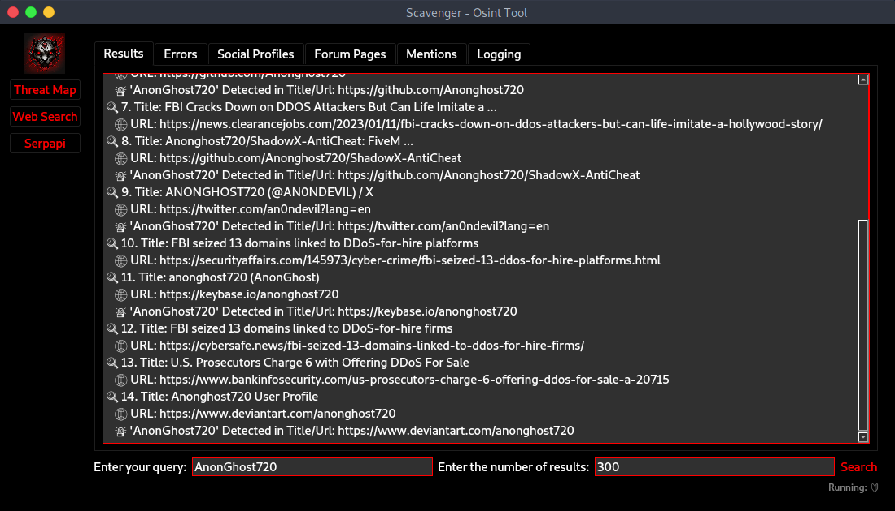
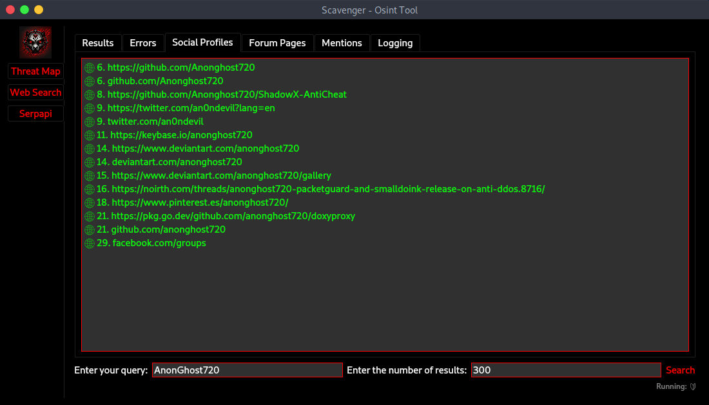
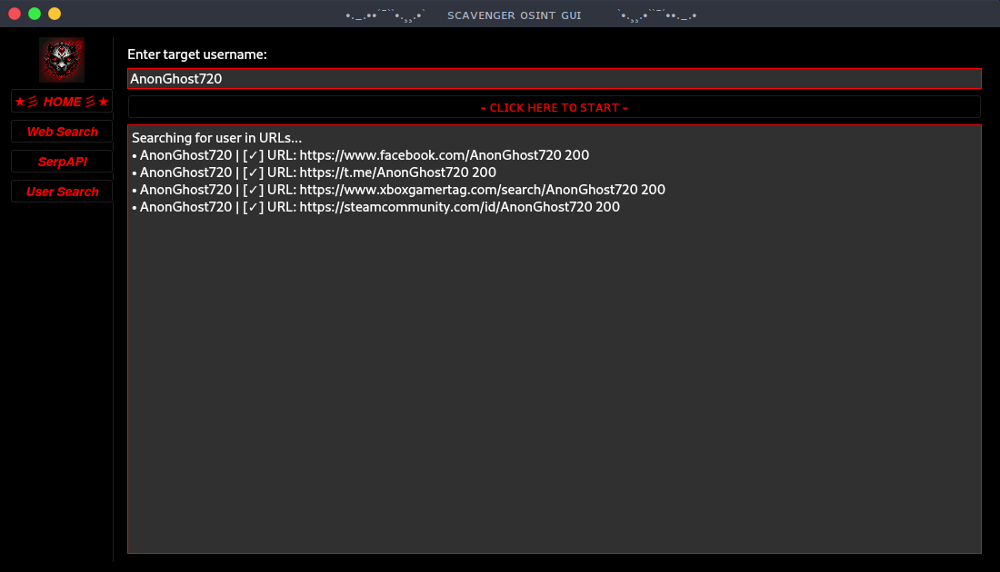
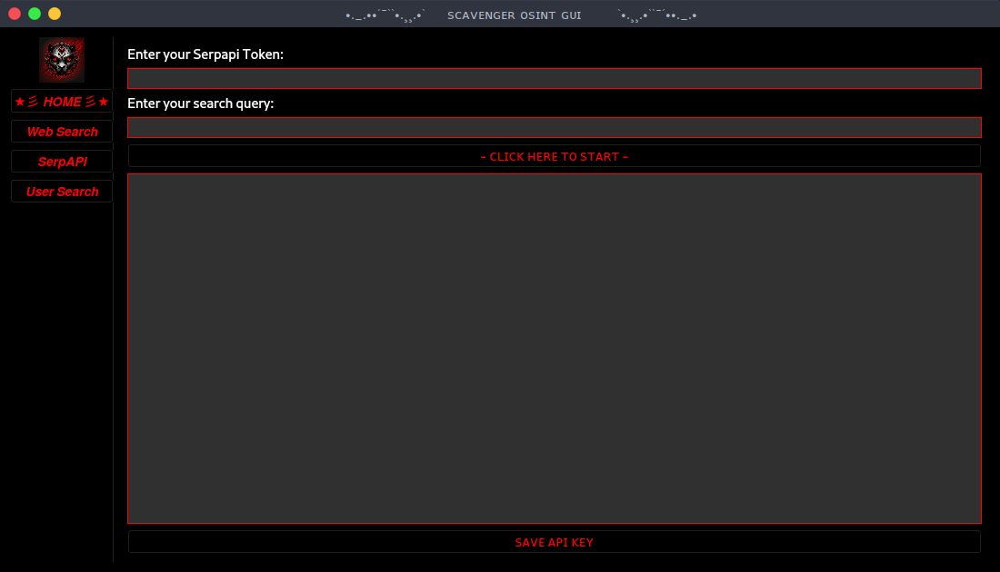

> **Scavenger OSINT GUI** 🕵️‍♂️
---
- **UPDATE 2.7**
*°_ Bug fixes*
*°_ Holehe Tool (email2registery)*
    also a favorite tool made
      by someone else.

*°_ Nmap Automated (byme)*

**//- ExpectedInUpdate:**
*°_ IP tools "geolocation, portscan (normal&full), TCP&UDP ping*

## About Scavenger

> Scavenger is a powerful and user-friendly Open Source Intelligence (OSINT) tool designed to enhance digital reconnaissance capabilities. With its intuitive graphical user interface, Scavenger provides a unified solution for various OSINT tasks, allowing users to efficiently gather information about a target. This tool is developed with the goal of empowering individuals and security professionals to conduct responsible and effective information gathering.

> Scavenger is a robust and feature-rich tool for Open Source Intelligence (OSINT). Its impressive set of capabilities, including advanced search options, system information gathering, and social profile recognition, make it a valuable asset for various purposes such as security audits, digital investigations, and threat intelligence. The user-friendly graphical interface and emphasis on delivering targeted and actionable results contribute to its appeal. However, the true measure of its impressiveness depends on the specific needs and preferences of users within the OSINT community.

## Table of Contents

- [Key Features](#key-features)
- [Dependencies](#dependencies)
- [Installation](#installation)
- [Usage](#usage)
- [Digital Reconnaissance](#digital-reconnaissance)
- [Targeted and Actionable Results](#targeted-and-actionable-results)
- [Updates and Changelog](#updates-and-changelog)
- [Security Considerations](#security-considerations)
- [License](#license)
- [Author](#author)
- [Contributing](#contributing)
- [Acknowledgments](#acknowledgments)

**Important:**
- **Use this tool responsibly and in accordance with applicable laws and regulations.**
- **Authors are not responsible for any misuse or damage caused.**

## Key Features 🚀

- **Web Search:** Conduct Google searches and retrieve detailed results.
- **User Search:** Search for a target user across specified URLs.
- **Serpapi Search:** Utilize the Serpapi API for advanced search capabilities.
- **Info Gathering:** Collect system information using Python and PyQt5.
- **Forum Detection:** Identify potential forums based on URL patterns.
- **Social Profile Recognition:** Detect and display social media profiles.

## Dependencies 🛠️

- Python 3.x
- PyQt5
- httpx
- beautifulsoup4
- fake_useragent
- serpapi
- requests
- colorama

## Installation 📦

1. **Clone the repository: `git clone https://github.com/AnonCatalyst/Scavenger`**
2. **Install dependencies: `python3 install.py`**

## Usage 🚨

1. **Launch the application: `python scavenger.py`**
2. **Choose a search category from the side menu.**
3. **Enter the required information.**
4. **Click the search button to initiate the search.**

**Information Obtained:**
- **Discover online mentions of a query or username.**
- **Identify potential social profiles and forums.**

## Digital Reconnaissance

- **Robust solution for digital reconnaissance.**
- **Gathers and analyzes publicly available information from online sources.**

## Targeted and Actionable Results

- **Delivers results that are targeted and actionable.**
- **Emphasis on providing users with relevant information.**

## Potential Use Cases 🎯

- **Scavenger can be employed for various purposes, including:**

    ``Security Audits: Enhance security audits by uncovering potential vulnerabilities and identifying digital footprints.
    Digital Investigations: Facilitate digital investigations by collecting and analyzing information related to specific targets.
    Online Reputation Management: Monitor and manage online presence by tracking mentions and social profiles.
    Threat Intelligence: Strengthen threat intelligence efforts by staying informed about potential threats and emerging trends.``

## Updates and Changelog

- **For a detailed list of changes, see the [Changelog](CHANGELOG.md).**

## Security Considerations

- **Use this tool responsibly and refer to the [Security Guidelines](docs/SECURITY.md) for best practices.**

## License 📄

- **This project is licensed under the MIT License - see the [LICENSE](LICENSE) file for details.**

## Author 👤

- **AnonCatalyst**
  - **GitHub: [AnonCatalyst](https://github.com/AnonCatalyst)**

## Contributing 🤝

- **Contributions are welcome! Check out the [Contribution Guidelines](CONTRIBUTING.md).**

## Acknowledgments 🙏

- **Mention any external libraries or tools used.**
- **Inspiration, if any.**

---
> **Disclaimer:** **Use this tool responsibly and in accordance with applicable laws and regulations.**
> **Authors are not responsible for any misuse or damage caused.**

---
> **Images:**

 | 
:-------------------------:|:-------------------------:
 | 

