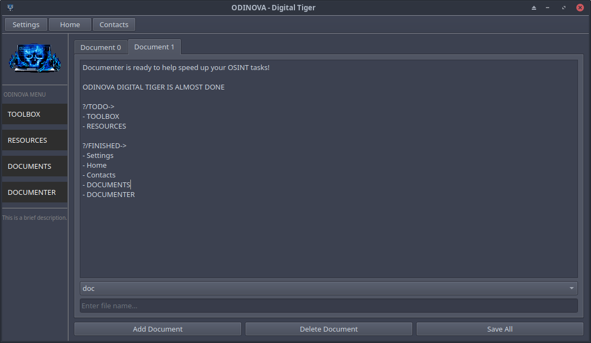
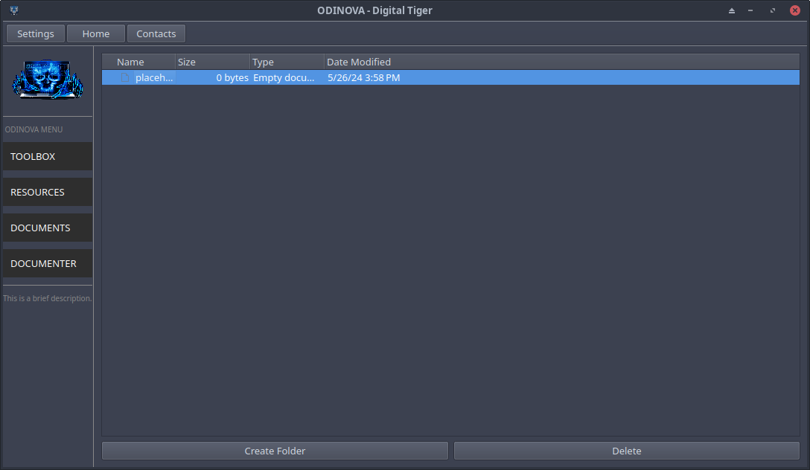

{ **Odinova Digital Tiger©️** 🕵️‍♂️ }

*?FINISHED-SO-FAR:+ `3 tools have been introduced to the OTWindow and each have there very own window that you can easily change between, you can also click a button to install tool requirements`

*?TO-DO:* `Create the launching method and window items`

-- **Support Server** `Help us grow our discord server or contact support by joining up today!` 
- https://discord.com/invite/rwjNemwere

🤔 Where did everything go❓️ `Don't worry, just check Releases and you'll see you can download the old application as Odinova-OLD or you can directly download it through the link bellow ⤵️`

[Odinova-old.zip](https://github.com/AnonCatalyst/Odinova/files/15425823/Odinova-old.zip)
> This is the release of _Odinova_ that was previously known as **Scavenger OSINT GUI**.

## REBUILD CONSTRUCTION ACTIVE 🚧 
> ⚠️ **This tool is currently being rebuilt! see more of development progress through my instagram** 💪 
## About Odinova 

> **Odinova Digital Tiger** is a powerful and user-friendly Open Source Intelligence (OSINT) tool designed to enhance digital reconnaissance capabilities. With its intuitive graphical user interface, Odinova provides a unified solution for various OSINT tasks, allowing users to efficiently gather information about a target. This tool is developed with the goal of empowering individuals and security professionals to conduct responsible and effective information gathering more efficiently.
