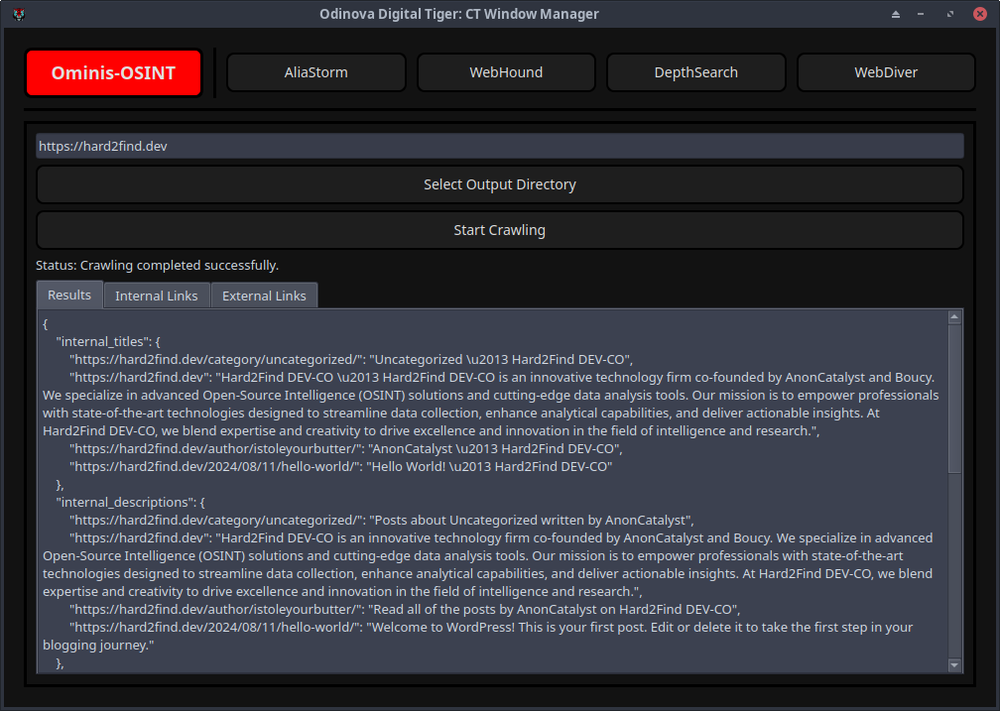

{ **Odinova Digital Tiger:BETA:©️** 🕵️‍♂️ }

> **UP-COMMING** `Under construction... OT-WINDOW UPDATE COMMING SOON!  paused`
- **Finished**: ``CT-Window.(Custom Tools Window)``

## HOW TO INSTALL/RUN?
- ```git clone https://github.com/AnonCatalyst/Odinova && cd Odinova```
- ```pip install -r requirements.txt --break-system-packages```
- ```python3 odinova.py```

-- **Support Server** `Help us grow our discord server or contact support by joining up today!` 
- https://discord.com/invite/rwjNemwere


# Odinova Digital Tiger: Overview

Odinova Digital Tiger is an advanced application designed for Open-Source Intelligence (OSINT), equipped with versatile tools and a user-friendly interface to streamline investigative workflows and enhance data analysis capabilities.

### Documenter: Document Management

**Purpose:** Manages and documents investigative findings through documentation files.

- **Features:**
  - **Tabbed Interface:** Allows users to manage multiple doc files simultaneously using QTabWidget.
  - **Markdown Rendering:** Converts Markdown content into HTML for clear and structured presentation using QTextBrowser.
  - **File Operations:** Supports operations such as saving all documents, importing Markdown files, and opening existing files.
  - **Dark Theme Integration:** Implements a dark theme interface for enhanced readability and reduced eye strain during prolonged use.

<p>
  
  
  
</p>

### ResourcesWindow: Markdown File Viewer

**Purpose:** Provides a centralized view of Markdown files stored within the application.

- **Features:**
  - **Tabbed Navigation:** Presents Markdown files in a tabbed interface using QTabWidget for organized access.
  - **HTML Rendering:** Converts Markdown content to HTML for display using QTextBrowser within a scrollable area.
  - **Import Functionality:** Allows users to import additional Markdown files from external sources using QFileDialog.
  - **Dark Theme Support:** Applies a dark theme to the interface for improved user experience and readability.

## Application Benefits for OSINT

Odinova Digital Tiger enhances OSINT operations by:

- **Centralized Tools:** Integrates diverse tools for email reconnaissance, social media analysis, web searches, and deep web exploration into a unified platform.
- **Efficient Data Management:** Facilitates the organization, storage, and retrieval of investigative findings through structured interfaces and file management functionalities.
- **Enhanced Collaboration:** Promotes collaboration among investigators by providing shared resources and real-time updates on search progress and results.
- **Comprehensive Documentation:** Supports thorough documentation of intelligence findings through documentation files, ensuring clarity, accessibility, and preservation of investigative insights.

## Conclusion

Odinova Digital Tiger represents a robust solution for OSINT practitioners, offering a comprehensive suite of tools and functionalities tailored to streamline investigative workflows, enhance data analysis capabilities, and promote effective collaboration. By combining powerful tools with intuitive interfaces, the application empowers users to conduct thorough investigations, manage findings efficiently, and document insights effectively within a secure and user-friendly environment.

