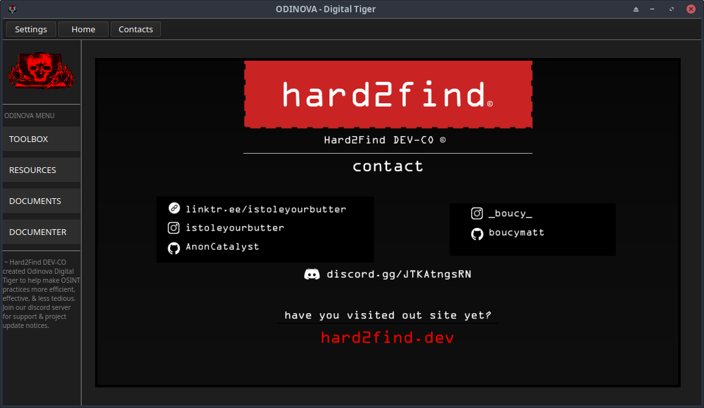

># Scavenger OSINT GUI 🕵️‍♂️

Scavenger is an Open Source Intelligence (OSINT) tool with a graphical user interface that helps you gather information about a target efficiently.

🚀 Happy OSINTing! 🕵️‍♂️

## Key Features 🚀

- **Web Search:** Perform Google searches and retrieve results.
- **User Search:** Search for a target user across specified URLs.
- **Serpapi Search:** Utilize the Serpapi API for advanced search capabilities.
- **Info Gathering:** Collect system information using Python and PyQt5.
- **Forum Detection:** Identify potential forums based on URL patterns.
- **Social Profile Recognition:** Detect and display social media profiles.

## Dependencies 🛠️

- Python 3.x
- PyQt5
- httpx
- beautifulsoup4
- fake_useragent
- serpapi
- requests
- colorama

## Installation 📦

1. Clone the repository: `git clone https://github.com/AnonCatalyst/Scavenger.git`
2. Install dependencies: `pip install -r requirements.txt`

## Usage 🚨

1. Launch the application: `python scavenger.py`
2. Choose a search category from the side menu.
3. Enter the required information.
4. Click the search button to initiate the search.

**Information Obtained**
    Discover online mentions of a query or username.
    Identify potential social profiles and forums.

**Why Scavenger?**
    Scavenger offers a unified solution for multiple OSINT tasks.
    Threading improves efficiency for username searches.
    
### Digital Reconnaissance
Positioned as a robust solution for digital reconnaissance, Scavenger excels in gathering and analyzing publicly available information from online sources. The toolkit empowers users with the capability to navigate and extract valuable insights from the vast landscape of digital data.

### Targeted and Actionable Results
Scavenger is dedicated to delivering results that are not only targeted but also actionable. The emphasis is on providing users with information that is relevant to their investigations and capable of guiding informed decision-making.

## License 📄

This project is licensed under the MIT License - see the [LICENSE](LICENSE) file for details.

## Author 👤

- AnonCatalyst
- GitHub: [AnonCatalyst](https://github.com/AnonCatalyst)

## Contributing 🤝

Contributions are welcome! Check out the [Contribution Guidelines](CONTRIBUTING.md).

## Acknowledgments 🙏

- Mention any external libraries or tools used.
- Inspiration, if any.

---
> **Disclaimer:** Use this tool responsibly and in accordance with applicable laws and regulations. The authors are not responsible for any misuse or damage caused.

---
> **Images:**

